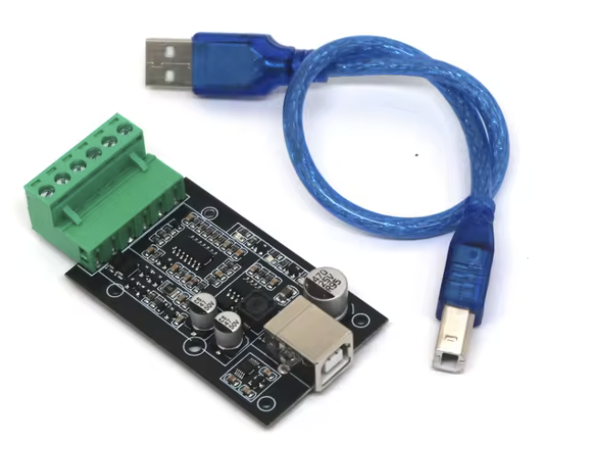

# Home Assistant ABB B23 M-Bus via MQTT sensor

This is a Home Assistant sensor that reads the ABB B23-113 M-Bus via MQTT. The meter itself is a slave device - so you need a M-Bus master with sufficient power to drive the bus. I bought and use this cheap one:

[https://de.aliexpress.com/item/1005006205311636.html](https://de.aliexpress.com/item/1005006205311636.html)



In the **case**-Folder you find the models for a simple 3d printed case.

## Configuration, build and run

1. Edit **sensor/const.py** to setup the MQTT broker and the ABB B23 M-Bus device.

2. Build the Docker image:
   `sudo docker build -t abb_b23_meterbus .`

3. Run the Docker container:
   `sudo docker run -it -d --name abb_b23_meterbus --restart unless-stopped --device=/dev/ttyUSB0 abb_b23_meterbus`

4. Add the following code to your `configuration.yaml` file and restart Home Assistant:

````yaml
mqtt:
    sensor:
    - name: "ABB B23 Active Power Total"
      state_topic: "homeassistant/sensor/abb_b23_mbus"
      value_template: "{{ value_json.data.active_power_total.value }}"
      unit_of_measurement: "W"
      device_class: "power"
      state_class: "measurement"

    - name: "ABB B23 Active Power L1"
      state_topic: "homeassistant/sensor/abb_b23_mbus"
      value_template: "{{ value_json.data.active_power_l1.value }}"
      unit_of_measurement: "W"
      device_class: "power"
      state_class: "measurement"

    - name: "ABB B23 Active Power L2"
      state_topic: "homeassistant/sensor/abb_b23_mbus"
      value_template: "{{ value_json.data.active_power_l2.value }}"
      unit_of_measurement: "W"
      device_class: "power"
      state_class: "measurement"

    - name: "ABB B23 Active Power L3"
      state_topic: "homeassistant/sensor/abb_b23_mbus"
      value_template: "{{ value_json.data.active_power_l3.value }}"
      unit_of_measurement: "W"
      device_class: "power"
      state_class: "measurement"

    - name: "ABB B23 Voltage L1"
      state_topic: "homeassistant/sensor/abb_b23_mbus"
      value_template: "{{ value_json.data.voltage_l1.value }}"
      unit_of_measurement: "V"
      device_class: "voltage"
      state_class: "measurement"

    - name: "ABB B23 Voltage L2"
      state_topic: "homeassistant/sensor/abb_b23_mbus"
      value_template: "{{ value_json.data.voltage_l2.value }}"
      unit_of_measurement: "V"
      device_class: "voltage"
      state_class: "measurement"

    - name: "ABB B23 Voltage L3"
      state_topic: "homeassistant/sensor/abb_b23_mbus"
      value_template: "{{ value_json.data.voltage_l3.value }}"
      unit_of_measurement: "V"
      device_class: "voltage"
      state_class: "measurement"

    - name: "ABB B23 Voltage L1-L2"
      state_topic: "homeassistant/sensor/abb_b23_mbus"
      value_template: "{{ value_json.data.voltage_l1_l2.value }}"
      unit_of_measurement: "V"
      device_class: "voltage"
      state_class: "measurement"

    - name: "ABB B23 Voltage L3-L2"
      state_topic: "homeassistant/sensor/abb_b23_mbus"
      value_template: "{{ value_json.data.voltage_l3_l2.value }}"
      unit_of_measurement: "V"
      device_class: "voltage"
      state_class: "measurement"

    - name: "ABB B23 Voltage L1-L3"
      state_topic: "homeassistant/sensor/abb_b23_mbus"
      value_template: "{{ value_json.data.voltage_l1_l3.value }}"
      unit_of_measurement: "V"
      device_class: "voltage"
      state_class: "measurement"

    - name: "ABB B23 Current L1"
      state_topic: "homeassistant/sensor/abb_b23_mbus"
      value_template: "{{ value_json.data.current_l1.value }}"
      unit_of_measurement: "A"
      device_class: "current"
      state_class: "measurement"

    - name: "ABB B23 Current L2"
      state_topic: "homeassistant/sensor/abb_b23_mbus"
      value_template: "{{ value_json.data.current_l2.value }}"
      unit_of_measurement: "A"
      device_class: "current"
      state_class: "measurement"

    - name: "ABB B23 Current L3"
      state_topic: "homeassistant/sensor/abb_b23_mbus"
      value_template: "{{ value_json.data.current_l3.value }}"
      unit_of_measurement: "A"
      device_class: "current"
      state_class: "measurement"

    - name: "ABB B23 Energy Total"
      state_topic: "homeassistant/sensor/abb_b23_mbus"
      value_template: "{{ value_json.data.energy_total.value }}"
      unit_of_measurement: "kWh"
      device_class: "energy"
      state_class: "total_increasing"

    - name: "ABB B23 Energy L1"
      state_topic: "homeassistant/sensor/abb_b23_mbus"
      value_template: "{{ value_json.data.energy_l1.value }}"
      unit_of_measurement: "kWh"
      device_class: "energy"
      state_class: "total_increasing"

    - name: "ABB B23 Energy L2"
      state_topic: "homeassistant/sensor/abb_b23_mbus"
      value_template: "{{ value_json.data.energy_l2.value }}"
      unit_of_measurement: "kWh"
      device_class: "energy"
      state_class: "total_increasing"

    - name: "ABB B23 Energy L3"
      state_topic: "homeassistant/sensor/abb_b23_mbus"
      value_template: "{{ value_json.data.energy_l3.value }}"
      unit_of_measurement: "kWh"
      device_class: "energy"
      state_class: "total_increasing"```
````
